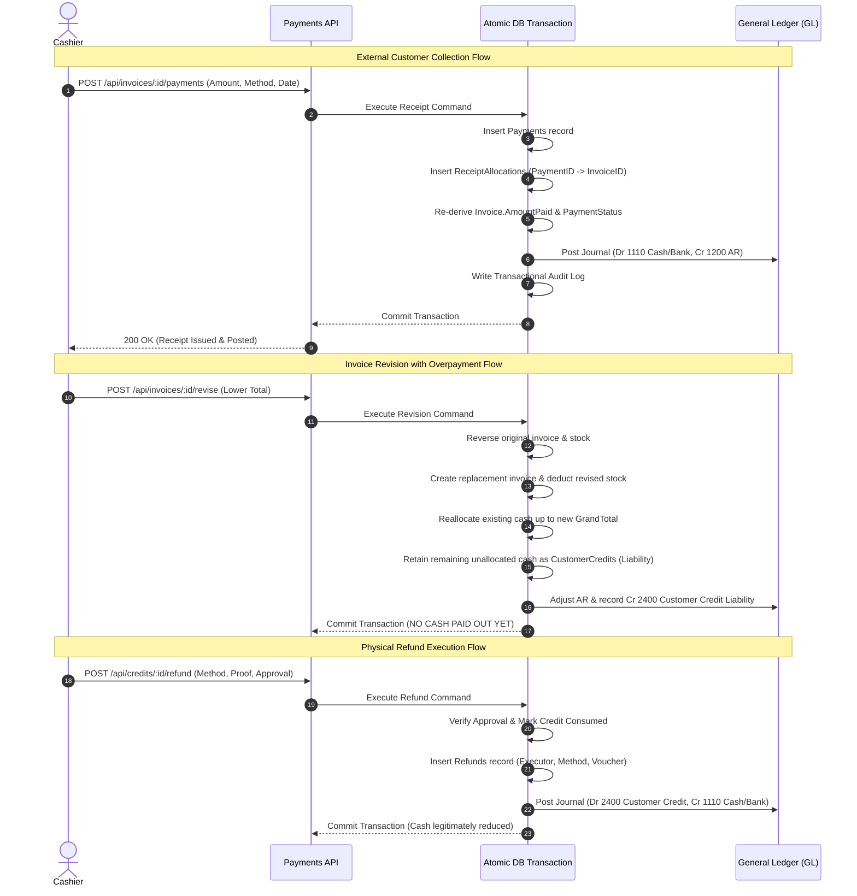
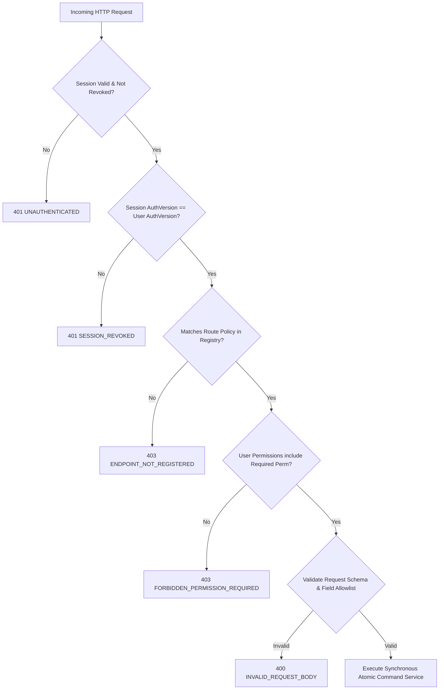

# Hydraulic System: Master Implementation & Security Super Plan

- **Author**: Antigravity Engineering (Pair-Programming Lead)
- **Date**: October 5, 2026
- **Repository**: [yohan114/hydraulic-system](https://github.com/yohan114/hydraulic-system)
- **Active Branch**: `create_super_plan` (forked from `claude/price-system-analysis-ono9vm` at commit `21a352f`)
- **Status**: Master Engineering Execution Blueprint & Technical Architecture
- **Baseline Verification**: 267/267 tests passing (`node --test`, duration ~4.4s)

---

## 1. Executive Summary & Codebase Baseline Verification

This Super Plan operationalizes the **Hydraulic System: Complete Improvement and Security Plan** into an authoritative, phased implementation roadmap. Rather than treating previous findings as hypothetical, every finding was physically inspected and verified against the running code and database schema in this workspace.

### 1.1 Verified Codebase Baseline & Concrete Evidence

| Finding ID | Classification | Verified File & Line | Concrete Code Mechanism & Failure Mode |
|---|---|---|---|
| **FIN-01** | P0 (Critical) | [invoices.js](file:///C:/Users/HP/.gemini/antigravity/worktrees/dashboard/create_super_plan/dashboard/routes/invoices.js#L445-L458) | **Non-atomic finalize posting**: Invoice header, items, and inventory deductions commit. Ledger posting `glPosting.postInvoice()` occurs *afterward* in a detached `try/catch`. If ledger posting fails (e.g., empty date or closed period), error is logged with `console.error` while HTTP 200 with `{ invoiceId, posting: { error } }` is returned to the client. |
| **FIN-02** | P0 (Critical) | [invoiceRevision.js](file:///C:/Users/HP/.gemini/antigravity/worktrees/dashboard/create_super_plan/dashboard/services/invoiceRevision.js#L171-L189) | **Non-atomic payment void**: SQLite transaction updates `Payments.VoidedAt` and re-derives `Invoices.AmountPaid`. *Outside* the transaction, `reversePaymentJournal()` is called in a separate `try/catch`. If ledger reversal fails, the operational payment remains voided while GL cash/receivables are permanently out of sync. |
| **FIN-03** | P0 (Critical) | [invoiceRevision.js](file:///C:/Users/HP/.gemini/antigravity/worktrees/dashboard/create_super_plan/dashboard/services/invoiceRevision.js#L160-L180), [payments.js](file:///C:/Users/HP/.gemini/antigravity/worktrees/dashboard/create_super_plan/dashboard/routes/payments.js#L83-L95) | **Conflation of refund obligations with cash reversals**: When a revised invoice has a lower grand total than cash already collected, excess cash is either voided from the receipt or carried forward without tracking an explicit `CustomerCredit` liability or recording actual physical cash payout. |
| **FIN-04** | P0 (Critical) | [invoices.js](file:///C:/Users/HP/.gemini/antigravity/worktrees/dashboard/create_super_plan/dashboard/routes/invoices.js#L274-L282) | **Omission of ownership columns in creation paths**: `invoiceHeaderColumns()` and `invoiceHeaderValues()` omit `IsInternal`, `CustomerID`, and `MachineID` during `POST /api/invoices/draft` and `finalize` inserts, relying on defaults or leaving them unlinked. |
| **AUD-01** | P1 (High) | [audit.js](file:///C:/Users/HP/.gemini/antigravity/worktrees/dashboard/create_super_plan/dashboard/lib/audit.js#L13-L14) | **Detached swallowed audit logging**: `res.on('finish')` writes audit rows after the response completes. Code comments explicitly state: *"Every failure here is swallowed; a broken audit table must not stop the shop invoicing."* A broken disk or locked DB lets financial actions execute with zero audit trace. |
| **AUD-02** | P1 (Medium) | [audit.js](file:///C:/Users/HP/.gemini/antigravity/worktrees/dashboard/create_super_plan/dashboard/lib/audit.js#L78) | **No read/export audit**: Middleware explicitly filters `if (!MUTATING.has(req.method)) return next();`. Sensitive data exfiltration, price list dumps, customer phone exports, and profit analysis downloads generate zero audit trail. |
| **REP-01** | P1 (Medium) | [reports.js](file:///C:/Users/HP/.gemini/antigravity/worktrees/dashboard/create_super_plan/dashboard/routes/reports.js#L16-L34), [finance.js](file:///C:/Users/HP/.gemini/antigravity/worktrees/dashboard/create_super_plan/dashboard/routes/finance.js#L20-L40) | **Timestamp divergence across reports**: KPI dashboard groups sales by `Invoices.FinalizedAt`, monthly reports group by `Invoices.InvoiceDate`, and financial reports group by `JournalEntries.Date`. Month-end figures across screens do not reconcile. |
| **COST-01** | P1 (Medium) | [jobProfitExport.js](file:///C:/Users/HP/.gemini/antigravity/worktrees/dashboard/create_super_plan/dashboard/services/jobProfitExport.js#L27-L35) | **Distorted export costing**: Hardcoded `SUNDRY_RATE = 0.10` ('Sundry (Electricity) Cost (10%)') added to job cost, while crimping/welding labour substitutes outside market charges instead of true technician accrual costs. |
| **AUTH-01** | P0 (Critical) | [server.js](file:///C:/Users/HP/.gemini/antigravity/worktrees/dashboard/create_super_plan/dashboard/server.js#L20-L22), [auth.js](file:///C:/Users/HP/.gemini/antigravity/worktrees/dashboard/create_super_plan/dashboard/routes/auth.js#L11-L42) | **Production auth-bypass & hardcoded credentials**: `BILLING_AUTH !== 'off'` allows completely disabling authentication via environment variable; `FALLBACK_PASSWORD || 'admin123'` printed to stdout on startup. |
| **AUTH-02** | P1 (High) | [users.js](file:///C:/Users/HP/.gemini/antigravity/worktrees/dashboard/create_super_plan/dashboard/routes/users.js#L56), [auth.js](file:///C:/Users/HP/.gemini/antigravity/worktrees/dashboard/create_super_plan/dashboard/lib/auth.js#L68) | **Weak password & session hygiene**: 4-character minimum password check; stateless 12-hour signed tokens without revocation table or session versioning; password change does not invalidate outstanding tokens. |
| **AUTH-03** | P0 (Critical) | [auth.js](file:///C:/Users/HP/.gemini/antigravity/worktrees/dashboard/create_super_plan/dashboard/routes/auth.js#L48-L55) | **Fail-open bootstrap trap**: `provisioningState()` wraps `SELECT COUNT(*) FROM Users` in a `try/catch` and on ANY DB error returns `{ provisioned: false, tableMissing: true }`. This causes `checkCredentials` to fall back to the default `admin / admin123` bootstrap credentials during transient database errors! |
| **DATA-01** | P0 (Assessment) | Root directory | **Sensitive production artifacts in working tree**: Root directory contains `hydraulic.db` (552 KB with historical shop data), 5 Excel spreadsheets (`Inventory_Import_HS25E1112W1.xlsx`, `June_Invoice_Profit_Analysis.xlsx`, etc.), and `signature.png`. |
| **AUTHZ-01** | P1 (High) | [server.js](file:///C:/Users/HP/.gemini/antigravity/worktrees/dashboard/create_super_plan/dashboard/server.js#L35-L38), [routes/*.js](file:///C:/Users/HP/.gemini/antigravity/worktrees/dashboard/create_super_plan/dashboard/routes/) | **Broad monolithic roles without permission granularity**: Three coarse roles (`admin`, `cashier`, `viewer`) checked via sporadic `requireRole('admin')` or the coarse `viewerReadOnlyGuard`. No record-level scoping, no separation of duties for refunds, adjustments, or period reopenings. |

---

## 2. Core Architectural Pillars & System Invariants

### 2.1 The Synchronous Atomic Transaction Paradigm
In `better-sqlite3`, transactions are synchronous and in-process. The previous pattern of using `await connection.query(...)` across multi-step business logic forced the codebase into best-effort compensation loops and mutexes (`invoiceMutex`).

```mermaid
flowchart TD
    subgraph Previous Architecture (Fragmented & Leaky)
        A1[Receive HTTP Request] --> A2[Acquire Async Mutex]
        A2 --> A3[Update Invoices / Items]
        A3 --> A4[Deduct Inventory Qty]
        A4 --> A5[Release Mutex]
        A5 --> A6[Call glPosting in try/catch]
        A6 -- Fails --> A7[Log console.error & Return 200 with partial state]
    end

    subgraph Target Super Plan Architecture (Synchronous Atomic Unit)
        B1[Receive HTTP Request] --> B2[Authorize Endpoint & Permissions]
        B2 --> B3[Validate Request Schema & Business Invariants]
        B3 --> B4[Begin Synchronous SQLite Transaction: db.transaction]
        B4 --> B5[Update Invoices & Item Snapshots]
        B5 --> B6[Insert Stock Movements & Deduct Stock]
        B6 --> B7[Post Balanced General Ledger Journal & Lines]
        B7 --> B8[Record Transactional Business Audit Entry]
        B8 --> B9[Store Scoped Idempotency Result]
        B9 --> B10[Commit Transaction Atomic Unit]
        B10 -- Any Error --> B11[Automatic Full Rollback - Zero Partial State]
    end
```

**Non-negotiable Rule**: Every mutating financial command (`finalize`, `revise`, `voidPayment`, `recordPayment`, `cancel`, `stockAdjustment`, `postExpense`) MUST execute inside a single `db.transaction(...)` block. If ledger posting, stock validation, or transactional audit fails, the transaction rolls back cleanly.

### 2.2 Billing Ownership, Presentation, and Settlement Invariants

To eliminate confusion between company internal plant maintenance and external customer sales:

```text
JobOwnership:     INTERNAL | EXTERNAL
DocumentView:     COMPANY_DETAILED | CUSTOMER_SIMPLIFIED
SettlementStatus: NOT_APPLICABLE | UNPAID | PARTIAL | PAID | CREDIT_BALANCE
```

#### The Immutable Invariants:
1. **Mandatory Ownership**: Every invoice, job card, and quotation MUST have a verified `IsInternal` boolean and `CustomerID` at draft creation and finalization.
2. **Customer Binding**:
   - If `Customers.Kind = 'internal'`, then `IsInternal = 1`.
   - If `Customers.Kind = 'external'`, then `IsInternal = 0`.
3. **No Revenue/Receivables on Internal Work**:
   - `IsInternal = 1` bills record: `Dr 6900 Internal Repairs & Maintenance`, `Cr 1300 Inventory`.
   - No lines may touch `1200 Accounts Receivable`, `4100 Sales - Parts`, `4200 Sales - Technical`, or `2300 Taxes Payable`.
4. **Strict API Payment Rejection**:
   - `POST /api/invoices/:id/payments` MUST immediately reject payments if `invoice.IsInternal === 1` with HTTP 409 Conflict (`INTERNAL_WORK_NO_PAYMENTS`).
5. **Presentation Decoupled from Accounting**:
   - `DocumentView` controls whether line-item breakdown is detailed or simplified for printing. It NEVER alters the general ledger posting or ownership.

### 2.3 True Cash Settlement, Allocations, and Refund Obligations



1. **Receipt Allocations**: Payments are decoupled into a collection event (`Payments`) and an allocation event (`ReceiptAllocations`).
2. **Refund Obligations**: A downward revision or overpayment generates a `CustomerCredits` liability row. Cash in hand/bank is NEVER reduced until an authorized physical refund payout is executed.

---

## 3. Target Data Model & Database Migrations

Three additive migrations will be introduced in `dashboard/migrations/`:

### 3.1 Migration `0012-financial-atomicity-allocations.js`

```sql
-- 1. Receipt allocations linking cash collected to specific invoices
CREATE TABLE IF NOT EXISTS ReceiptAllocations (
  AllocationID     INTEGER PRIMARY KEY AUTOINCREMENT,
  PaymentID        INTEGER NOT NULL REFERENCES Payments(PaymentID) ON DELETE RESTRICT,
  InvoiceID        INTEGER NOT NULL REFERENCES Invoices(InvoiceID) ON DELETE RESTRICT,
  Amount           REAL NOT NULL CHECK (Amount > 0),
  AllocatedAt      TEXT NOT NULL,
  AllocatedBy      TEXT,
  CreatedAt        TEXT NOT NULL DEFAULT (Now())
);
CREATE INDEX IF NOT EXISTS idx_allocations_payment ON ReceiptAllocations(PaymentID);
CREATE INDEX IF NOT EXISTS idx_allocations_invoice ON ReceiptAllocations(InvoiceID);

-- 2. Customer credit balances arising from downward revisions or approved overpayments
CREATE TABLE IF NOT EXISTS CustomerCredits (
  CreditID         INTEGER PRIMARY KEY AUTOINCREMENT,
  CustomerID       INTEGER NOT NULL REFERENCES Customers(CustomerID) ON DELETE RESTRICT,
  SourceType       TEXT NOT NULL CHECK (SourceType IN ('revision', 'overpayment', 'manual')),
  SourceID         INTEGER NOT NULL,
  OriginalAmount   REAL NOT NULL CHECK (OriginalAmount > 0),
  RemainingAmount  REAL NOT NULL CHECK (RemainingAmount >= 0),
  Status           TEXT NOT NULL DEFAULT 'open' CHECK (Status IN ('open', 'utilized', 'refunded', 'voided')),
  Notes            TEXT,
  CreatedAt        TEXT NOT NULL DEFAULT (Now()),
  CreatedBy        TEXT
);
CREATE INDEX IF NOT EXISTS idx_credits_customer ON CustomerCredits(CustomerID, Status);

-- 3. Formal physical cash/bank refund payouts
CREATE TABLE IF NOT EXISTS Refunds (
  RefundID         INTEGER PRIMARY KEY AUTOINCREMENT,
  CreditID         INTEGER NOT NULL REFERENCES CustomerCredits(CreditID) ON DELETE RESTRICT,
  CustomerID       INTEGER NOT NULL REFERENCES Customers(CustomerID) ON DELETE RESTRICT,
  Amount           REAL NOT NULL CHECK (Amount > 0),
  RefundDate       TEXT NOT NULL,
  PaymentMethod    TEXT NOT NULL CHECK (PaymentMethod IN ('Cash', 'Bank Transfer', 'Cheque')),
  ReferenceNo      TEXT,
  ApprovedBy       TEXT NOT NULL,
  ExecutedBy       TEXT NOT NULL,
  JournalID        INTEGER REFERENCES JournalEntries(JournalID),
  CreatedAt        TEXT NOT NULL DEFAULT (Now())
);

-- 4. Idempotency table for network retries and replay protection
CREATE TABLE IF NOT EXISTS IdempotencyKeys (
  KeyID            INTEGER PRIMARY KEY AUTOINCREMENT,
  IdempotencyKey   TEXT NOT NULL UNIQUE,
  ActorID          TEXT NOT NULL,
  Operation        TEXT NOT NULL,
  RequestHash      TEXT NOT NULL,
  ResponseCode     INTEGER NOT NULL,
  ResponseBody     TEXT NOT NULL,
  CreatedAt        TEXT NOT NULL DEFAULT (Now()),
  ExpiresAt        TEXT NOT NULL
);
CREATE INDEX IF NOT EXISTS idx_idempotency_lookup ON IdempotencyKeys(IdempotencyKey, ActorID);
```

### 3.2 Migration `0013-rbac-permissions-sessions.js`

```sql
-- 1. Granular permission definitions
CREATE TABLE IF NOT EXISTS Permissions (
  PermissionID     INTEGER PRIMARY KEY AUTOINCREMENT,
  Code             TEXT NOT NULL UNIQUE,
  Description      TEXT NOT NULL,
  Module           TEXT NOT NULL
);

-- 2. Role definitions (replacing hardcoded string checks)
CREATE TABLE IF NOT EXISTS Roles (
  RoleID           INTEGER PRIMARY KEY AUTOINCREMENT,
  Name             TEXT NOT NULL UNIQUE,
  Description      TEXT
);

-- 3. Role-Permission mappings
CREATE TABLE IF NOT EXISTS RolePermissions (
  RoleID           INTEGER NOT NULL REFERENCES Roles(RoleID) ON DELETE CASCADE,
  PermissionID     INTEGER NOT NULL REFERENCES Permissions(PermissionID) ON DELETE CASCADE,
  PRIMARY KEY (RoleID, PermissionID)
);

-- 4. User-Role mappings
CREATE TABLE IF NOT EXISTS UserRoles (
  UserID           INTEGER NOT NULL REFERENCES Users(UserID) ON DELETE CASCADE,
  RoleID           INTEGER NOT NULL REFERENCES Roles(RoleID) ON DELETE CASCADE,
  PRIMARY KEY (UserID, RoleID)
);

-- 5. User-Site/Company Scope boundaries
CREATE TABLE IF NOT EXISTS UserScopes (
  ScopeID          INTEGER PRIMARY KEY AUTOINCREMENT,
  UserID           INTEGER NOT NULL REFERENCES Users(UserID) ON DELETE CASCADE,
  CompanyID        INTEGER NOT NULL DEFAULT 1,
  SiteID           TEXT NOT NULL DEFAULT 'main',
  UNIQUE (UserID, CompanyID, SiteID)
);

-- 6. Server-side session tracking and revocation
CREATE TABLE IF NOT EXISTS Sessions (
  SessionID        TEXT PRIMARY KEY,
  UserID           INTEGER NOT NULL REFERENCES Users(UserID) ON DELETE CASCADE,
  AuthVersion      INTEGER NOT NULL DEFAULT 1,
  CreatedAt        TEXT NOT NULL DEFAULT (Now()),
  ExpiresAt        TEXT NOT NULL,
  RevokedAt        TEXT,
  RevokedReason    TEXT,
  LastSeenAt       TEXT NOT NULL DEFAULT (Now()),
  IPAddress        TEXT,
  UserAgent        TEXT
);
CREATE INDEX IF NOT EXISTS idx_sessions_user ON Sessions(UserID, RevokedAt);
```

### 3.3 Migration `0014-transactional-audit-approvals.js`

```sql
-- 1. Hardened Transactional Business Audit Table
CREATE TABLE IF NOT EXISTS BusinessAuditLog (
  AuditID          INTEGER PRIMARY KEY AUTOINCREMENT,
  TxID             TEXT NOT NULL,
  At               TEXT NOT NULL DEFAULT (Now()),
  ActorID          TEXT NOT NULL,
  ActorRole        TEXT,
  Action           TEXT NOT NULL,
  EntityType       TEXT NOT NULL,
  EntityID         TEXT NOT NULL,
  PayloadBefore    TEXT,
  PayloadAfter     TEXT,
  Reason           TEXT
);
CREATE INDEX IF NOT EXISTS idx_business_audit_entity ON BusinessAuditLog(EntityType, EntityID);
CREATE INDEX IF NOT EXISTS idx_business_audit_actor ON BusinessAuditLog(ActorID, At);

-- 2. Dual-Control Approval Registry
CREATE TABLE IF NOT EXISTS Approvals (
  ApprovalID       INTEGER PRIMARY KEY AUTOINCREMENT,
  ApprovalType     TEXT NOT NULL, -- 'refund', 'period_reopen', 'price_override', 'stock_adjust'
  TargetEntity     TEXT NOT NULL,
  TargetID         TEXT NOT NULL,
  PayloadHash      TEXT NOT NULL,
  RequestedBy      TEXT NOT NULL,
  RequestedAt      TEXT NOT NULL DEFAULT (Now()),
  ApprovedBy       TEXT,
  ApprovedAt       TEXT,
  Status           TEXT NOT NULL DEFAULT 'pending' CHECK (Status IN ('pending', 'approved', 'rejected', 'consumed', 'expired')),
  DecisionReason   TEXT,
  ExpiresAt        TEXT NOT NULL
);
CREATE INDEX IF NOT EXISTS idx_approvals_lookup ON Approvals(ApprovalType, TargetEntity, TargetID, Status);
```

---

## 4. Centralized Endpoint-Policy Authorization Engine

### 4.1 Default-Deny Access Policy Architecture
All requests under `/api/` pass through a centralized gate:
```text
ALLOW = Active Authenticated Session
        AND Valid AuthVersion
        AND Endpoint Policy Match
        AND Principal has Required Permission
        AND Scoped Record Access
        AND Valid Workflow State
```
Any route missing from the policy table returns HTTP 403 `ENDPOINT_NOT_REGISTERED`.



### 4.2 Endpoint Policy Registry Matrix

| Method | Path Pattern | Required Permission | Description & Risk Category |
|---|---|---|---|
| `GET` | `^/invoices$` | `invoice.read` | View invoice list |
| `GET` | `^/invoices/[1-9]\d*$` | `invoice.read` | View invoice detail (cost fields filtered for cashiers) |
| `POST` | `^/invoices/draft$` | `invoice.create` | Save or update draft invoice |
| `POST` | `^/invoices/finalize$` | `invoice.finalize` | Finalize draft, deduct stock, post ledger |
| `POST` | `^/invoices/[1-9]\d*/revise$` | `invoice.revise` | Supersede invoice, atomic correction |
| `POST` | `^/invoices/[1-9]\d*/cancel$` | `invoice.cancel` | Cancel unpaid invoice, restore stock |
| `GET` | `^/invoices/[1-9]\d*/payments$` | `receipt.read` | Read payments and allocations |
| `POST` | `^/invoices/[1-9]\d*/payments$` | `receipt.create` | Record external customer payment |
| `POST` | `^/payments/[1-9]\d*/void$` | `receipt.correct` | Void erroneous receipt & reverse GL |
| `POST` | `^/credits/[1-9]\d*/refund/request$` | `refund.request` | Request cash refund from customer credit |
| `POST` | `^/credits/[1-9]\d*/refund/approve$` | `refund.approve` | Approve refund (dual control) |
| `POST` | `^/credits/[1-9]\d*/refund/execute$` | `refund.execute` | Execute physical refund payout |
| `GET` | `^/inventory$` | `inventory.read` | Inventory list (cost masked for viewers) |
| `POST` | `^/inventory/adjust$` | `inventory.adjust` | Stock take adjustment |
| `POST` | `^/ledger/journals$` | `journal.create` | Post manual journal entry |
| `POST` | `^/ledger/periods/close$` | `period.close` | Close financial period |
| `POST` | `^/ledger/periods/reopen$` | `period.reopen` | Reopen period (Manager/Admin approval) |
| `GET` | `^/reports/financial/.*` | `report.financial.view` | View balance sheet, trial balance, P&L |
| `GET` | `^/reports/financial/.*/export$` | `report.financial.export` | Export financial statements (Audited) |
| `POST` | `^/users$` | `user.manage` | Create user, assign roles |

---

## 5. Granular Phased Delivery Plan

### Phase 0: Baseline Freeze, Safety Containment & Data Hygiene
- **Duration**: 4 Working Days
- **Key Deliverables**:
  1. **DATA-01 Containment**: Safely archive `hydraulic.db` and spreadsheets to protected offline storage. Create a clean, sanitized `test-fixtures.db` for development and automated testing.
  2. **AUTH-03 Remediation**: Rewrite `dashboard/routes/auth.js` `provisioningState()` to distinguish empty `Users` table from runtime DB errors. Transient errors MUST throw and return 503 Service Unavailable, NEVER falling back to bootstrap admin credentials.
  3. **AUTH-01 Remediation**: Remove `BILLING_AUTH === 'off'` option. Startup refuses to boot without explicit `BILLING_SECRET`. Enforce single-use bootstrap token via CLI command (`npm run bootstrap-admin`).
  4. **Baseline Lock**: Verify all 267 existing tests continue passing without regression.

### Phase 1: Financial & Transactional Integrity Core
- **Duration**: 10 Working Days
- **Key Deliverables**:
  1. **Migration 0012**: Apply `ReceiptAllocations`, `CustomerCredits`, `Refunds`, and `IdempotencyKeys`.
  2. **Synchronous glPosting Engine**: Refactor `glPosting.js` to provide synchronous prepared statement posting routines (`postInvoiceSync`, `postPaymentSync`, `reverseEntrySync`).
  3. **Atomic Commands**:
     - Rewrite `routes/invoices.js` `finalize` inside synchronous `db.transaction(...)` (FIN-01).
     - Rewrite `services/invoiceRevision.js` `voidPayment` to reverse GL inside transaction (FIN-02).
     - Rewrite `services/invoiceRevision.js` `reviseInvoice` to preserve cash allocations and generate `CustomerCredits` for overpayment (FIN-03).
     - Update `invoiceHeaderColumns()` to explicitly persist `IsInternal`, `CustomerID`, and `MachineID` in draft and finalization paths (FIN-04).
  4. **Strict API Payment Guard**: Block receipt creation against `IsInternal = 1` invoices.

### Phase 2: Centralized Identity, Session & Authorization Engine
- **Duration**: 10 Working Days
- **Key Deliverables**:
  1. **Migration 0013**: Apply `Roles`, `Permissions`, `RolePermissions`, `UserRoles`, `UserScopes`, and `Sessions`.
  2. **Route-Policy Registry Middleware**: Mount `authorizeEndpoint` in `server.js` matching every `/api/*` route against explicit regex patterns and permissions. Default deny (403 `ENDPOINT_NOT_REGISTERED`).
  3. **Session Lifecycle & Revocation**: Implement server-side session lookup with `AuthVersion`. When user password or permissions change, increment `Users.AuthVersion` to immediately invalidate active tokens.
  4. **AUTH-02 Remediation**: Enforce 12-character minimum password with complexity checks. Transition tokens to 15-minute access + secure HttpOnly refresh cookies.
  5. **Field-Level Security**: Add response scrubber middleware stripping cost/margin fields from unauthorized roles.

### Phase 3: Workflow, Domain Separation & Reconciliation
- **Duration**: 10 Working Days
- **Key Deliverables**:
  1. **Internal Workflows Separation**:
     - Separate UI for Internal Service Statements vs External Customer Invoices.
     - PDF template updates: "Company detailed copy" for internal review; "Sales Invoice" for customers; "Internal service/cost statement" for own fleet.
  2. **Reconciliation Engine & Dashboard**:
     - Inventory valuation vs GL Control Account `1300`.
     - Accounts Receivable vs unpaid customer invoice balances.
     - Supplier Payables vs GL Account `2100`.
     - Technician Accruals vs paid labour records.
     - Detect completeness exceptions (e.g., finalized invoice without GL journal).
  3. **REP-01 & COST-01 Remediation**:
     - Standardize report filters on `AccountingDate` across all modules.
     - Remove arbitrary 10% sundry electricity adder and outside market labour substitution from `jobProfitExport.js`. Disclose actual technician accruals alongside outside benchmarks.

### Phase 4: Operational Hardening, Approvals & Dual-Audit
- **Duration**: 7 Working Days
- **Key Deliverables**:
  1. **Migration 0014**: Apply `BusinessAuditLog` and `Approvals`.
  2. **AUD-01 & AUD-02 Remediation**:
     - Integrate synchronous `BusinessAuditLog` writes inside financial transactions.
     - Implement separate asynchronous `SecurityAuditLog` capturing logins, export downloads, and access denials.
  3. **Dual-Control Approval Workflow**: Implement request/approve/execute endpoints for refunds, period reopenings, and manual stock adjustments.
  4. **Idempotency Engine**: Enable client idempotency keys on all financial mutations.
  5. **Backup & Recovery Verification**: Automated daily backup with tested integrity check (`PRAGMA integrity_check`).

### Phase 5: Verification, Acceptance Testing & Production Cutover
- **Duration**: 7 Working Days
- **Key Deliverables**:
  1. **Automated T01–T34 Acceptance Test Suite**: Full suite covering all 34 acceptance scenarios.
  2. **Historical Data Migration Rehearsal**: Dry run classification of historical invoices on backup database, reconciliation of control accounts, accountant sign-off.
  3. **Controlled Cutover Runbook**: Write freeze, final backup, schema migration, verification smoke tests, write unfreeze.

---

## 6. Master Acceptance Testing Matrix (T01 – T34)

| Test ID | Scenario Description | Input Fixture / Action | Expected Result & Assertions |
|---|---|---|---|
| **T01** | Finalize internal work | Invoice with internal customer (`Kind = 'internal'`) | Stock reduced; `Dr 6900 / Cr 1300` posted; `GrandTotal` not in AR; `PaymentStatus = 'Not Applicable'` |
| **T02** | Direct API receipt for internal work | `POST /api/invoices/:id/payments` on internal invoice | HTTP 409 `INTERNAL_WORK_NO_PAYMENTS`; zero DB changes |
| **T03** | Change external invoice print layout | Request `DocumentView = 'COMPANY_DETAILED'` | Layout includes internal costs; GL entries & revenue remain external sale |
| **T04** | Replay finalize command with same key | Repeat `POST /api/invoices/finalize` with same `IdempotencyKey` | Returns cached original response; zero duplicate stock deduction or journal |
| **T05** | Replay same key with modified body | Send identical key with different line items | HTTP 409 `IDEMPOTENCY_PAYLOAD_MISMATCH`; request rejected |
| **T06** | Concurrent stock-consuming finalize | Two parallel requests consuming remaining 1 item | Exactly 1 succeeds; 1 fails with HTTP 409 `INSUFFICIENT_STOCK`; stock = 0 |
| **T07** | Journal failure during finalization | Injected GL posting error (e.g., closed period) | Entire transaction rolls back; draft remains draft; stock unaffected |
| **T08** | Reversal failure during receipt void | Injected GL reversal error on payment void | Entire transaction rolls back; payment remains un-voided; balance unchanged |
| **T09** | Revise paid invoice (same amount) | Revise invoice with payment attached | Cash preserved; reallocated to replacement invoice; GL AR netted |
| **T10** | Downward revision of paid invoice | Original bill 10,000 paid; revised bill 8,000 | 8,000 allocated to new bill; 2,000 `CustomerCredit` created; cash in hand untouched |
| **T11** | Wrong-invoice collection correction | Reallocate payment from Invoice A to Invoice B | Payment reallocated; Invoice A balance restored; Invoice B balance credited; zero cash flow change |
| **T12** | Closed-period correction | Revise invoice from closed month | Correction dated into current open month; closed period remains locked |
| **T13** | Missing/expired/revoked session | Request with invalid or revoked token | HTTP 401 `UNAUTHENTICATED`; zero internal details disclosed |
| **T14** | Viewer submits mutating write | Viewer role calls `POST /api/invoices/draft` | HTTP 403 `FORBIDDEN_PERMISSION_REQUIRED`; request blocked |
| **T15** | Cashier requests journal reversal | Cashier calls `POST /api/ledger/reverse/:id` | HTTP 403 `FORBIDDEN`; cashier restricted from GL reversals |
| **T16** | Disabled/demoted user uses old token | User revoked; submits request with valid JWT | HTTP 401 `SESSION_REVOKED` due to `AuthVersion` mismatch |
| **T17** | IDOR: Access out-of-scope record | User attempts to access invoice belonging to other site | HTTP 404 `NOT_FOUND` (preventing existence disclosure) |
| **T18** | Scoped list & aggregate query | Query `/api/invoices` under scoped user | Returns only allowed site records; totals match filtered rows |
| **T19** | Unregistered route requested | Call `/api/experimental-feature` not in policy registry | HTTP 403 `ENDPOINT_NOT_REGISTERED`; CI test flags missing route policy |
| **T20** | Encoded URL traversal / bypass | Send `/api/invoices/..%2fadmin` or trailing slashes | Normalized and evaluated strictly against policy table; no bypass |
| **T21** | Protected extra fields submitted | Send `{ AmountPaid: 999999, IsInternal: 1 }` in payment body | Extra fields rejected with HTTP 400 or stripped; server derives values |
| **T22** | Unauthorized cost fields requested | Cashier requests invoice details | `UnitCostAtBilling` and `ProfitAmount` scrubbed from response |
| **T23** | Requester approves own refund | Cashier requests refund and calls approve | HTTP 403 `SELF_APPROVAL_PROHIBITED` |
| **T24** | Approved transaction content altered | Change refund amount after approval | Approval token invalidated (`HASH_MISMATCH`) |
| **T25** | Approval replay attack | Attempt to execute same approved refund voucher twice | Second attempt fails: `APPROVAL_ALREADY_CONSUMED` |
| **T26** | Mandatory business audit failure | Injected disk/DB error on `BusinessAuditLog` write | Financial transaction rolls back completely |
| **T27** | Sensitive export requested | User exports profit spreadsheet | Request authorized; entry written to `SecurityAuditLog` with IP & row count |
| **T28** | Formula injection in CSV/Excel export | Customer name contains `=cmd\|' /C calc'!A0` | Sanitized with leading quote (`'=...`); inert in spreadsheet viewers |
| **T29** | Internal background job command | Job invokes command service directly | Validates identical domain invariants as HTTP endpoints |
| **T30** | Database backup restoration drill | Restore snapshot to clean environment | `PRAGMA integrity_check` passes; trial balance balances; app runs |
| **T31** | GL Trial Balance completeness check | Delete 1 journal entry on test DB | Reconciliation service reports orphaned invoice missing journal |
| **T32** | Technician labour accrual & payout | Accrue job labour, then pay technician | Recognized as labour expense once; payable cleared; no double-costing |
| **T33** | Pricing catalogue update | Update fitting price from 1,200 to 1,500 | Historical finalized invoices retain snapshotted 1,200 rate |
| **T34** | Internal job conversion / revision | Convert quotation to job, then invoice | Ownership (`IsInternal = 1`) preserved through all transitions |

---

## 7. Governance, Approvals & Implementation Sign-Off

### 7.1 Phase-Gate Exit Criteria
- **Gate 0 (Phase 0 Complete)**: Zero default credentials, fail-closed auth, isolated production files, 267/267 baseline tests pass.
- **Gate 1 (Phase 1 Complete)**: Every financial write is atomic inside `db.transaction`; failure injection leaves zero partial state.
- **Gate 2 (Phase 2 Complete)**: 100% of `/api/*` endpoints covered by policy registry; default-deny verified by automated test.
- **Gate 3 (Phase 3 Complete)**: GL, receivables, and inventory reconcile on the dashboard; internal work strictly separated.
- **Gate 4 (Phase 4 Complete)**: Approvals required for refunds/adjustments; transactional audit enforced; idempotency tested.
- **Gate 5 (Phase 5 Complete)**: All 34 acceptance tests (T01–T34) passing; accountant sign-off on opening balances; production cutover complete.
