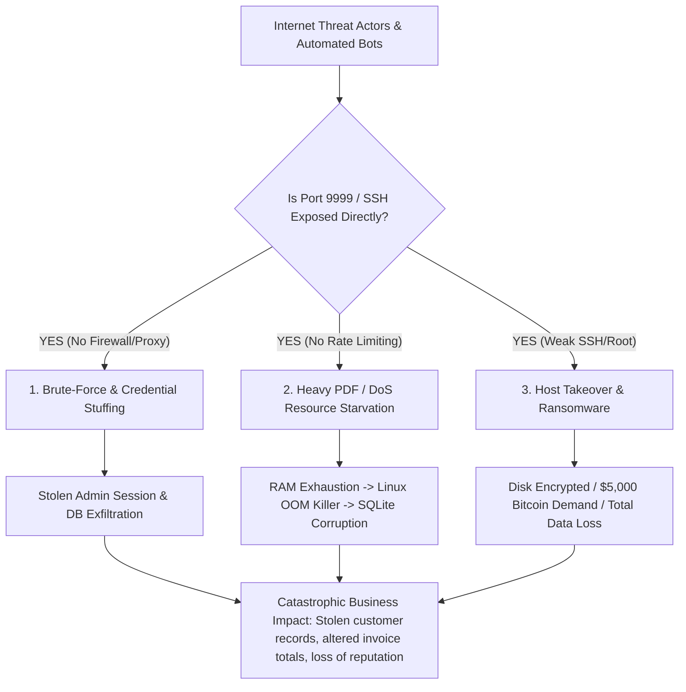
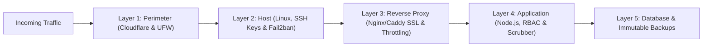
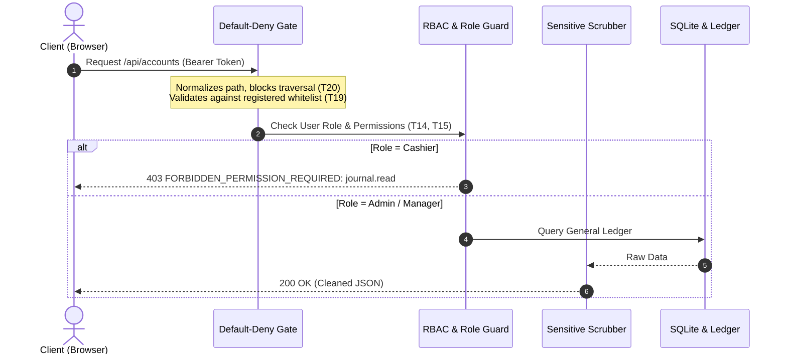
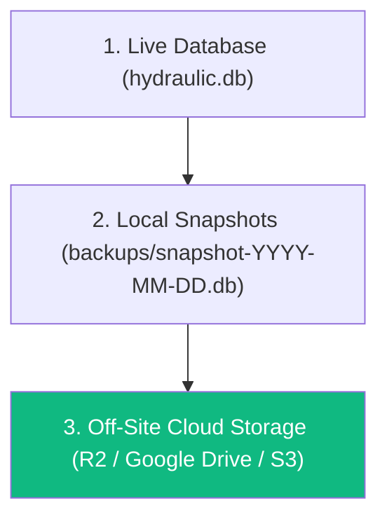

# System Security Master Plan & Cyberattack Threat Model

This document outlines the security architecture, real-world cyberattack scenarios, failure modes when security is insufficient, and a step-by-step hardening roadmap for deploying the **Edward & Christie Workshop Billing & ERP System** to a public Virtual Private Server (VPS).

---

## 1. What Happens During a Cyberattack When Security is Insufficient?

When a VPS is connected to a public IP address, automated port scanners and botnets begin probing it within **3 to 15 minutes**. Without proper security layers, the system fails in the following ways:



### Attack Scenario Breakdown & Failure Modes

| Attack Type | Attacker Action | System Response WITHOUT Security | Real Business Consequence |
|---|---|---|---|
| **Automated SSH Brute-Force** | Bots hammer port 22 with dictionary lists (`root/password`, `ubuntu/admin123`). | Open SSH permits thousands of tries per minute; weak root password breaks within hours. | Attacker gets full shell access, installs crypto miners, or deletes the database. |
| **Direct Application Probing** | Bots find port `9999` directly, bypassing Nginx/Caddy. | Node.js process is exposed without reverse proxy rate limiting, SSL, or WAF. | Direct access to raw API endpoints; unencrypted HTTP leaks passwords on public Wi-Fi. |
| **Credential Stuffing / Password Guessing** | Attacker scripts millions of login attempts on `/api/auth/login`. | Without account lockout or Fail2ban, CPU spikes from `scrypt` hashing; weak passwords breach. | Attacker logs in as Manager or Admin, downloads all financial statements and client data. |
| **Resource Exhaustion DoS (PDF Bomb)** | Bot floods `/api/job-profit/pdf` or `/api/invoices/:id/pdf` with 20 concurrent requests. | Each request launches headless Chromium (Puppeteer), consuming 150MB+ RAM each. | A 2GB VPS runs out of RAM, Linux OOM killer abruptly terminates the Node process, potentially corrupting SQLite in mid-write. |
| **Ransomware Extortion** | Scanners identify unpatched OS vulnerabilities or weak credentials. | Attacker runs an automated ransomware script encrypting `hydraulic.db` and leaves a `.txt` note. | Complete loss of customer billing history, outstanding debt records, and inventory data unless offline backups exist. |
| **Insider Data Theft / Ex-Staff Access** | Former employee whose phone/laptop is not revoked accesses the system from home. | Static session tokens remain valid indefinitely without `AuthVersion` or remote revocation. | Ex-employee views trade prices, customer phone numbers, or alters invoice balances. |

---

## 2. The Defense-in-Depth Security Master Plan

To eliminate these vulnerabilities, security is enforced across **5 distinct layers**. If any single layer is bypassed, the next layer stops the attacker.



---

### Layer 1: Network & Perimeter Defense

> [!IMPORTANT]
> The internal Node.js port (`9999`) must NEVER be exposed directly to the public internet.

1. **UFW (Uncomplicated Firewall)**:
   - Allow **ONLY** ports `80` (HTTP), `443` (HTTPS), and non-standard SSH (e.g. `2222`).
   - Explicitly block port `9999` from the outside world:
     ```bash
     sudo ufw default deny incoming
     sudo ufw default allow outgoing
     sudo ufw allow 2222/tcp comment 'SSH'
     sudo ufw allow 80/tcp comment 'HTTP'
     sudo ufw allow 443/tcp comment 'HTTPS'
     sudo ufw enable
     ```
2. **Cloudflare Proxy (Free Tier)**:
   - **Origin IP Masking**: Attackers scan domain names, not your raw VPS IP. Cloudflare absorbs all automated bot attacks before they reach your server.
   - **Geo-Blocking WAF Rule**: Block or challenge all traffic originating outside Sri Lanka (or authorized staff travel regions).
   - **DDoS Mitigation**: Automated HTTP flood absorption at Cloudflare's edge.

---

### Layer 2: Operating System & VPS Hardening

1. **SSH Key-Only Authentication**:
   - Disable password login for SSH.
   - Disable direct `root` login (`PermitRootLogin no`).
   - Move SSH from port `22` to a non-standard port (e.g., `2222`).
2. **Fail2ban Intrusion Prevention**:
   - Automatically monitors log files (`/var/log/auth.log`, `/var/log/nginx/error.log`).
   - Bans any IP address for **24 hours** after 5 failed authentication attempts:
     ```ini
     [sshd]
     enabled = true
     port = 2222
     maxretry = 5
     bantime = 86400

     [nginx-req-limit]
     enabled = true
     filter = nginx-limit-req
     logpath = /var/log/nginx/*error.log
     maxretry = 5
     bantime = 86400
     ```
3. **Dedicated Non-Root Service User**:
   - The application runs under an unprivileged user `workshop` (`adduser --system --group workshop`), never as `root`. Even in the unlikely event of a Remote Code Execution (RCE), the attacker cannot modify system files or access root credentials.
4. **Swap Memory Configuration**:
   - Provision a 2GB swap file (`/swapfile`) on Linux. This prevents the kernel Out-Of-Memory (OOM) killer from suddenly killing SQLite or Node.js during heavy PDF rendering.

---

### Layer 3: Reverse Proxy & Transport Security

Implemented in [`dashboard/deploy/nginx.conf`](file:///D:/hy%201/dashboard/deploy/nginx.conf) and [`dashboard/deploy/Caddyfile`](file:///D:/hy%201/dashboard/deploy/Caddyfile):

1. **Automated TLS / SSL Encryption**:
   - Free, auto-renewing Let's Encrypt certificates (via Certbot or Caddy).
   - Enforces modern TLS 1.2 / TLS 1.3 only; disables legacy, insecure ciphers.
2. **Rate Limiting Zones**:
   - **Login Endpoint**: Capped at `5 requests / minute` per IP with burst allowance of 3.
   - **General API**: Capped at `30 requests / second` per IP to stop scraping and DoS loops.
3. **Request Body Size Limits**:
   - `client_max_body_size 10M;` prevents memory exhaustion from oversized multipart payload attacks.
4. **Security Headers**:
   - `X-Frame-Options: SAMEORIGIN` (prevents embedding inside malicious iframes / clickjacking).
   - `X-Content-Type-Options: nosniff` (stops MIME sniffing).
   - `Strict-Transport-Security` (forces browsers to remember HTTPS).

---

### Layer 4: Application & Data Access Security

Already built and tested across [`dashboard/server.js`](file:///D:/hy%201/dashboard/server.js), [`dashboard/lib/endpointAuthorization.js`](file:///D:/hy%201/dashboard/lib/endpointAuthorization.js), and [`dashboard/routes/auth.js`](file:///D:/hy%201/dashboard/routes/auth.js):



1. **Default-Deny Policy (`ENDPOINT_NOT_REGISTERED`)**:
   - Any endpoint not explicitly declared in `POLICIES` is rejected with `403 Forbidden`.
2. **Role-Based Privilege Enforcement (RBAC)**:
   - **Cashier**: Can create invoices and record receipts, but **wholesale costs & margin percentages are dynamically scrubbed from all JSON responses** by `fieldScrubber`. Cannot cancel invoices or void payments.
   - **Manager**: Can approve dual-control refunds, manage inventory costs, and inspect job profits.
   - **Admin**: Full authority, user management, and ledger closing.
   - **Viewer**: Read-only; all mutating HTTP methods (`POST`, `PUT`, `DELETE`) return `403`.
3. **Session Revocation & Dual-Control Approvals**:
   - **Revoke Sessions**: Bumping `AuthVersion` immediately invalidates JWT tokens across all devices.
   - **Dual-Control (`SELF_APPROVAL_PROHIBITED`)**: A user who requests a refund cannot approve or execute their own payout.
4. **Security Audit Logging (`SecurityAuditLog`)**:
   - State-changing API calls record timestamp, actor username, role, client IP, action, resource, and row count.

---

### Layer 5: Data Resilience & 3-2-1 Backup Strategy

> [!WARNING]
> A server is not truly secure without off-site, immutable backups. If physical hardware fails or a ransomware attack compromises the machine, off-site backups are your only recovery path.



1. **Automated Daily Local Snapshots**:
   - Handled by [`dashboard/lib/backup.js`](file:///D:/hy%201/dashboard/lib/backup.js) using SQLite Online Backup API (`VACUUM INTO`).
   - Creates a transactionally consistent, zero-downtime copy every midnight.
2. **Encrypted Off-Site Sync**:
   - A daily cron job syncs compressed snapshots to cloud object storage (Cloudflare R2 or AWS S3) using `rclone`.
   - Even if the VPS is wiped or reformatted, yesterday's financial data is safe.
3. **Restoration Drill**:
   - Automated restoration verification ([`dashboard/test/security-audit-regression.test.js`](file:///D:/hy%201/dashboard/test/security-audit-regression.test.js#T30)) regularly validates that backed-up files pass `PRAGMA integrity_check` and that double-entry trial balances balance to zero.

---

## 3. Emergency Incident Response Runbook

If you suspect an active cyberattack or unusual activity on your VPS:

```
[ALERT DETECTED]
       │
       ▼
┌────────────────────────────────────────────────────────┐
│ STEP 1: ISOLATE                                        │
│ • Block suspicious IP in UFW:                          │
│   sudo ufw insert 1 deny from <ATTACKER_IP> to any    │
│ • Or temporarily enable Cloudflare "Under Attack" Mode │
└────────────────────────────────────────────────────────┘
       │
       ▼
┌────────────────────────────────────────────────────────┐
│ STEP 2: REVOKE & ROTATE                                │
│ • Log into #users and click "Revoke" on all users      │
│ • Rotate BILLING_SECRET in .env and restart PM2        │
└────────────────────────────────────────────────────────┘
       │
       ▼
┌────────────────────────────────────────────────────────┐
│ STEP 3: INSPECT AUDIT LOGS                             │
│ • Inspect SecurityAuditLog in the database:            │
│   sqlite3 hydraulic.db "SELECT * FROM SecurityAuditLog │
│   ORDER BY Timestamp DESC LIMIT 50;"                   │
└────────────────────────────────────────────────────────┘
       │
       ▼
┌────────────────────────────────────────────────────────┐
│ STEP 4: VERIFY / RESTORE DATA                          │
│ • Check database integrity: PRAGMA integrity_check;    │
│ • If tampered, restore from the latest snapshot        │
└────────────────────────────────────────────────────────┘
```

---

## 4. Implementation Checklist for VPS Launch

- [x] **Role Privileges & Access Control**: 4 roles active with UI hiding and API authorization.
- [x] **Sensitive Field Scrubber**: Unit costs and profits masked from cashiers.
- [x] **Session Revocation**: 1-click `AuthVersion` bump invalidates compromised devices.
- [x] **Security Headers**: HSTS, nosniff, SAMEORIGIN, XSS protection active.
- [x] **Audit Logging**: `SecurityAuditLog` captures IP addresses, actors, and export row counts.
- [x] **Automated Local Backups**: `VACUUM INTO` daily scheduler running.
- [x] **Production Deployment Scripts**: `setup-vps.sh`, `nginx.conf`, `Caddyfile`, `ecosystem.config.js` generated.
- [ ] **VPS Setup & UFW Activation**: Run `setup-vps.sh` on the Ubuntu VPS.
- [ ] **Cloudflare Proxy Connection**: Point DNS records through Cloudflare for free DDoS protection.
- [ ] **Off-site Cloud Backup**: Configure `rclone` with Google Drive or Cloudflare R2 for off-site sync.
